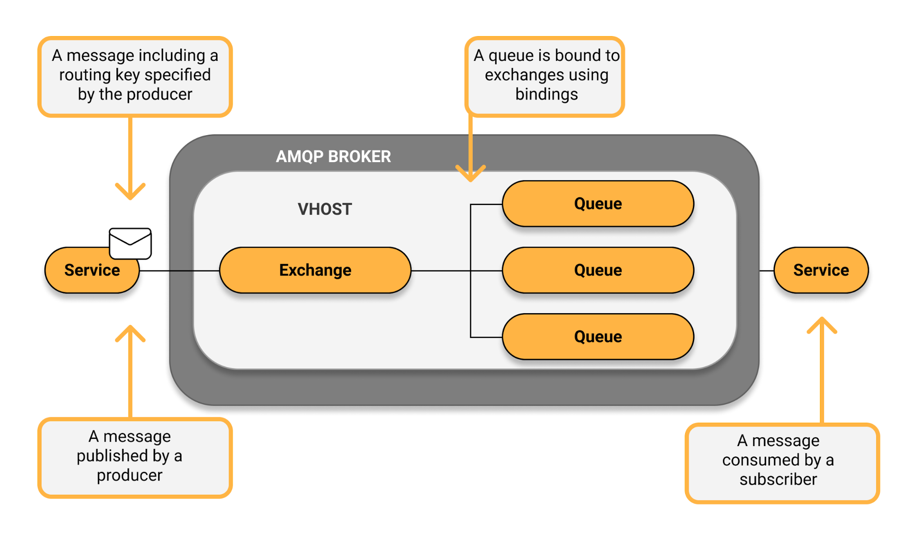

# springboot-rabbitmq-demo2

### Things to do list:

1. Clone this repository: `git clone https://github.com/hendisantika/springboot-rabbitmq-demo2.git`
2. Navigate to the folder: `cd springboot-rabbitmq-demo2`
3. Run the application: `mvn clean spring-boot:run`

### AMQP

Definition AMQP stands for Advanced Message Queuing Protocol. It is an open standard protocol that allows messaging
between systems. Different servers/systems can communicate with each other, regardless of technology. AMQP enables
message passing through broker services over TCP/IP connections. It defines both the network layer protocol and
high-level architecture for message brokers.

### AMQP model

Basic AMQP model is shown in the picture bellow:

https://www.cloudamqp.com/img/blog/amq-model.png

Typical message flow:

1. Producer publishes a message to an exchange. Message contains a routing key
2. Exchange receives the message and is responsible for the routing. It will copy the message and send it to queue(s)
   based on the exchange type, message’s routing key and message’s headers.
3. Binding — binding links exchanges with the queues. It contains a set of rules that exchange uses to route the message
   to the queues.
4. Message stays in the queue until it’s consumed by the consumer. Queue acts like as a buffer for messages, which will
   be consumed later.
5. Consumer handles the message

> _Important thing to remember is the fact, that **messages are not published directly to the queues**, but they are always being sent to the exchange._

### RabbitMQ and AMQP

RabbitMQ is a lightweight, scalable message broker, which uses AMQP protocol as a core protocol — supported AMQP version
is 0.9.1 natively, and version 1.0.0 via a plugin. If You want, You can use RabbitMQ with other protocols, e.g. STOMP.

### Exchanges

Default exchange Default exchange is a pre-declared direct exchange, which name is set to an empty string "". When a
message is send to the default exchange, then it will be routed to the queue with a queue name equal to the message
routing key. Every created queue is automatically bound to the default exchange, with the same routing key as queue
name.

### Direct exchange

Direct exchange uses message’s routing key, to route the message to a single queue. A routing key is set by the
producer, as a message header. A routing key in the message must exactly match the routing key specified in the binding
— it’s like an address, telling the exchange where a message should go.

### Fanout exchange

Fanout exchange copies and sends the received message to all queues bound to it. Provided routing key will be simply
ignored.

### Headers exchange

Headers exchange routes the message based on… it’s headers ! Routing key is ignored, and if the message headers match
binding configuration — the message will be sent to the bounded queue. Headers order does not matter. An argument
x-match is added to the binding between the exchange and the queue, and it can have two values:
all — all headers must match in order to route the message to the queue. This is the default value. any — at least one
header must match, to route the message to the queue. It’s worth to mention that in this case, header value may not be a
string, so it’s a little more flexible.

### Topic exchange

Topic exchange routes the message based on the the routing-key wildcard matching. Messages are being passed to one or
many queues. Although routing-key with wildcards is supported, it is not mandatory — You still can provide the routing
key implicitly, without any wildcards. Routing key is a list of words separated with . character, e.g. taxi.eco.small
and taxi.eco.large . You can use * symbol to match any word at a specific position, like taxi.*.large. Symbol # means
matching of zero or more words, like taxi.eco.# , which will match all routing keys starting with taxi.eco .

### Exchanges use cases

### Default exchange

Personally I don’t use it directly at all , and I always provide exchange name in a message producer. Because default
exchange is a direct exchange, let’s go to the next point.

### Direct exchange

Direct exchange is useful when You want to have a single exchange, and to specify the target “address” of the message,
based on a routing key filtering. One example can be a reporting system, which generates reports in a specified format,
asynchronously. A user clicks on a Generate report button and selects the target format- PDF or DOCX file. System
schedules report generation by sending a message to x.generate-report exchange, and specifies the target destination as
a routing key — pdf or docx . In such case, a producer provides an address for the message where should it be routed.

### Fanout exchange

Fanout exchange is useful when You want to send the message to one or more queues, and it’s ideal for broadcasting. It
it similar to publish/subscribe model — as a consumer, You subscribe for something, and publisher sends the message to
all subscribers. Message can be processed by different consumers in a different way. Routing key will be simply ignored.
Example: Your system publishes a message to x.order-created fanout exchange. It is going to copy and send the message
for all bounded subscribers — one subscriber might be a service which is going to generate the invoice to the customer.
Second subscriber might be a service, which will start a new process in the magazine, a process of collecting all the
order items and assembling them in a single shipment. These subscribers might be queues q.order.generate-invoice and
q.order.assemble-shipment , which will both receive a copy of the original message.

### Topic exchange

Topic exchange combines multiple message consumers with the filtering, based on the message routing key and wildcards
matching. It’s useful, when You want to send a message to potentially more than one bounded queue, but not necessarily
all of them. Let’s say that You produce a message with an information about the newly hired employee, and want to:

* notify the company’s software systems for HR and Payroll departments — they should register employee data in a core
  systems
* notify a single office where the employee is going to work — they should prepare a computer, a badge and some office
  space
* do not notify other offices In such case, You can route the message to queues:
* q.employees.newly-hired based on employee.newly-hired.office.warsaw routing key and employee.newly-hired.# matching
* q.employees.offices.warsaw based on employee.newly-hired.office.warsaw routing key and employee.*.office.warsaw
  matching

### Headers exchange

Headers exchange might be useful for routing based on a set of arguments, which are easier to configure as a message
headers than as a routing key, because header does not have to be a string. In this attribute, the routing key is going
to be ignored. It might act as a direct exchange (but with more conditions that routing-key equality).